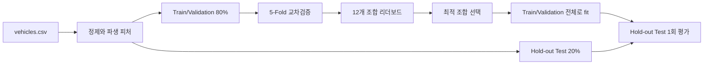
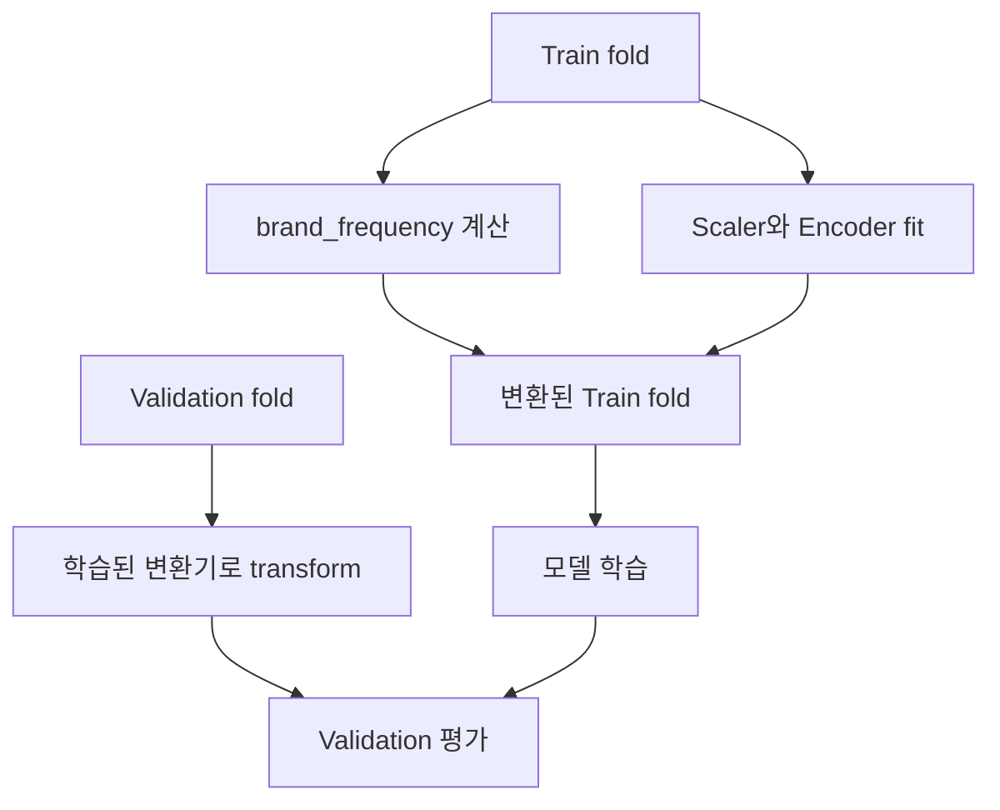

# UsedCar
## 교차검증 리더보드와 Hold-out 평가를 분리한 중고차 가격 예측

> Craigslist Vehicles Dataset을 기반으로 차량 판매 가격을 예측한 머신러닝 프로젝트입니다. 핵심은 “어떤 모델이 가장 좋아 보이는가”보다, 전처리와 모델 선택 과정에서 test 정보를 미리 보지 않도록 실험을 설계하는 데 있습니다.

## 한눈에 보기

| 구분 | 내용 |
| --- | --- |
| 문제 | 차량 속성으로 중고차 판매 가격을 예측하는 회귀 문제 |
| 데이터 | Craigslist Vehicles Dataset, 고정 시드 20,000건 샘플 |
| 검증 구조 | Train/Validation 80%와 Hold-out Test 20% 분리 |
| 선택 기준 | Train/Validation 내부 5-Fold 평균 MAE |
| 비교 범위 | Scaler 2종 × Encoder 2종 × Model 3종 = 12개 조합 |
| 프로젝트 상태 | 재실행 가능한 교육용 분석·모델링 파이프라인 |

---

## 1. 문제 정의

중고차 가격은 연식과 주행거리만으로 설명하기 어렵습니다. 제조사, 상태, 지역, 연식 대비 사용량, 판매글 정보처럼 서로 다른 유형의 정보가 함께 작용합니다.

이 프로젝트에서는 다음 질문을 다뤘습니다.

> 차량의 정형 데이터에서 가격과 관련된 특징을 만들고, 전처리·인코딩·회귀 모델의 조합을 같은 기준으로 비교한 뒤, 한 번도 보지 않은 데이터에서도 성능이 유지되는지 확인할 수 있는가?

따라서 단일 모델을 바로 학습하지 않고 **피처 설계 → 교차검증 리더보드 → Hold-out Test**를 하나의 실행 흐름으로 연결했습니다.



---

## 2. 데이터 준비

### 샘플링과 정제

Kaggle의 Craigslist Vehicles Dataset에서 고정 seed로 20,000건을 샘플링했습니다. 식별자, URL, 이미지 정보처럼 가격 예측과 직접 관련이 적은 열을 제외하고, 가격·연식·주행거리의 비현실적 이상치를 정리했습니다.

- 수치형 결측치: 중앙값 대체
- 범주형 결측치: `Unknown` 처리
- 가공 결과: 실행 환경에서 `processed_vehicles.csv`로 저장
- 데이터 분할: 정제 후 80% Train/Validation, 20% Hold-out Test

원본 데이터와 실행 중 생성되는 샘플·전처리 파일은 저장소에 포함하지 않습니다.

### 새로 만든 피처

| 피처 | 계산 방식 | 반영하려는 맥락 |
| --- | --- | --- |
| `car_age` | 기준 연도 - 차량 연식 | 연식에 따른 감가 |
| `odometer_per_year` | 주행거리 / 차량 나이 | 연식 대비 실제 사용량 |
| `is_high_mileage` | 연평균 주행거리 > 15,000 | 과주행 여부 |
| `posting_month` | 게시일에서 월 추출 | 판매 시점의 계절성 |
| `description_length` | 설명글 길이 | 판매 정보의 풍부함 |
| `brand_frequency` | 학습 데이터 내 제조사 출현 비율 | 제조사 분포 정보 |

---

## 3. 가장 중요하게 다룬 문제: 데이터 누수

### 전체 데이터로 전처리하지 않는다

`brand_frequency`, 범주형 빈도 인코딩, Scaler, Encoder는 전체 데이터에서 미리 학습하지 않습니다.

교차검증의 각 fold에서 다음 순서를 지킵니다.

1. Train fold와 Validation fold를 분리
2. Train fold에서만 빈도 피처·Scaler·Encoder를 `fit`
3. Validation fold에는 학습된 변환기를 `transform`만 적용
4. 각 fold 지표를 평균내 리더보드 생성

최종 Hold-out Test에서도 같은 원칙을 적용합니다. Test set은 Train/Validation 데이터로 만든 변환기만 사용합니다.



이 방식은 리더보드 점수가 실제보다 좋아 보이는 문제를 줄이기 위한 설계입니다.

---

## 4. 실험 설계

### 같은 조건에서 12개 조합을 비교

| 축 | 후보 | 비교 이유 |
| --- | --- | --- |
| Scaler | StandardScaler, RobustScaler | 수치형 변수의 스케일과 이상치 영향 비교 |
| Encoder | One-Hot Encoding, Frequency Encoding | 범주형 차량 정보의 표현 방식 비교 |
| Model | Random Forest, Gradient Boosting, 평균 앙상블 | 비선형 관계와 모델 결합 효과 비교 |

모든 조합을 Train/Validation 80% 안에서 5-Fold로 평가합니다. 평균 MAE가 가장 낮은 조합을 선택하고, RMSE·R²·MAPE도 함께 기록합니다.

### MAE를 선택 기준으로 둔 이유

MAE는 평균적으로 예측이 실제 가격에서 몇 달러 벗어나는지를 보여 줍니다. 중고차 가격 예측에서 오차 크기를 바로 해석하기 쉬워 리더보드의 정렬 기준으로 사용했습니다.

- **MAE**: 평균 절대 오차
- **RMSE**: 큰 오차에 더 민감한 오차 지표
- **R²**: 가격 변동을 모델이 설명하는 정도
- **MAPE**: 실제 가격 대비 오차 비율

---

## 5. 이전 실행 기록

아래 숫자는 원본 데이터가 저장소에 포함되기 전의 실행 기록입니다. 현재 코드는 fold 내부에서 변환기를 fit하도록 보완됐으므로, 최종 제출이나 면접에서 쓸 수치는 같은 데이터를 다시 실행해 갱신해야 합니다.

| 항목 | 이전 기록 |
| --- | ---: |
| 선택된 조합 | RobustScaler + One-Hot Encoder + Random Forest |
| 5-Fold 평균 MAE | **$4,704.28** |
| Hold-out Test MAE | **$4,755.79** |
| Hold-out Test RMSE | **$9,374.53** |
| Hold-out Test R² | **0.6673** |

교차검증 MAE와 Hold-out MAE의 차이가 크지 않은지 확인해, 선택된 조합이 격리된 데이터에서도 유지되는지 점검했습니다. 이 결과는 당시 실행 기록이며, 현재의 보장 성능이나 외부 일반화 성능을 의미하지 않습니다.

---

## 6. 코드 구조

```text
main.py
  데이터 준비 → 80/20 분리 → 5-Fold 리더보드 → 최종 Test 평가

src/
  preprocessing.py
    정제, 파생 피처, train 기준 brand_frequency
  experiments.py
    fold 내부 전처리와 12개 조합 교차검증
  __init__.py
    실행에 필요한 함수 export
```

`main.py`를 실행하면 데이터가 없을 때 원본 파일을 확인하고, 샘플링·정제·리더보드·최종 평가까지 순서대로 진행합니다. 실행 산출물은 데이터 폴더에 저장되며 Git 추적에서 제외됩니다.

---

## 7. 실행 방법

### 1) 데이터 준비

Kaggle의 [Craigslist Vehicles Dataset](https://www.kaggle.com/datasets/austinreese/craigslist-carstrucks-data/data)에서 `vehicles.csv`를 받아 아래 위치에 둡니다.

```text
data/vehicles.csv
```

데이터셋의 이용 조건은 Kaggle 페이지에서 확인해야 합니다.

### 2) 환경 설치와 실행

```bash
python -m pip install -r requirements.txt
python main.py
```

실행 후 콘솔에서 12개 조합 리더보드와 선택된 조합의 Hold-out Test 지표를 확인할 수 있습니다.

---

## 8. 해석의 한계와 다음 작업

### 현재 한계

- Craigslist 데이터의 시점·지역·게시 품질 편향이 남아 있을 수 있습니다.
- 가격은 옵션, 사고 이력, 실제 차량 상태처럼 데이터에 충분히 담기지 않은 변수의 영향도 받습니다.
- 기존 지표는 과거 실행 기록이므로 재실행 없이 최종 성능으로 제시하지 않습니다.
- 무작위 Hold-out만으로 시간에 따른 가격 변화나 지역 이동에 대한 일반화를 충분히 설명할 수 없습니다.

### 다음 작업

1. 동일 데이터와 현재 코드로 전체 리더보드를 재실행해 최종 지표 갱신
2. 연도·지역 기준 split을 추가해 시간·지역 일반화 확인
3. 잔차를 가격대·제조사·차량 연식별로 분석해 실패 조건 파악
4. 예측값과 실제값의 차이를 설명할 수 있는 feature importance·오류 사례 추가
5. 분석 결과를 가격 제안이나 재고 분류 같은 의사결정 화면으로 연결

---

## 9. 이 프로젝트에서 확인한 점

좋은 모델 선택은 마지막 단계입니다. 먼저 데이터가 어떻게 분리됐는지, 어떤 변환이 어디서 학습됐는지, test set을 언제 열어봤는지가 결과의 신뢰도를 결정합니다. 이 프로젝트는 중고차 가격 예측을 통해 그 검증 흐름을 코드로 구현한 사례입니다.
